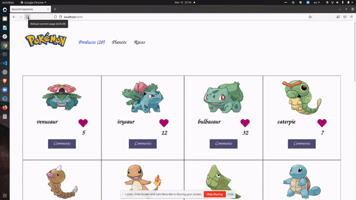

# Second Capstone JavaScript
> This is a web app where users can view all pokemons with their characteristics, abilities and types. Data is fetched from the Pokeapi. Here user can like, comment and view like and comments of him/her and others.

# GIF
- 

## Built With
- HTML
- Javascript
- CSS
- Webpack
- VScode
- Jest

## Live Demo
For the link to the live demo, [Click here](https://tufahel.github.io/second-capstone/)

## Getting Started
To get a local copy up and running you just need to follow the following steps;
- Clone this repository with
git clone https://github.com/Tufahel/second-capstone.git using your terminal or command line.
- run code `.` to open it in vscode
- run `npm install` in terminal
- run `npm start`
Now you are ready to use this web app.
- run `npm run test` to test the counter funtions.

## Authors

👤 **Author1**

- GitHub: [@Banstein](https://github.com/Banstein)
- Twitter: [@islam_bahnas](https://twitter.com/islam_bahnas)
- LinkedIn: [islam-bahnas](www.linkedin.com/in/islam-bahnas)

👤 **Author2**

- GitHub: [@Tufahel](https://github.com/Tufahel)
- Twitter: [@TufahelAhmed](https://twitter.com/TufahelAhmed)
- LinkedIn: [@tufahel-ahmed](https://www.linkedin.com/in/tufahel-ahmed)

## 🤝 Contributing

Contributions, issues, and feature requests are welcome!

Feel free to check the [issues page](../../issues/).

## Show your support

Give a ⭐️ if you like this project!

## Acknowledgments

- Microverse second capstone project.

## 📝 License

This project is [MIT](./MIT.md) licensed.
